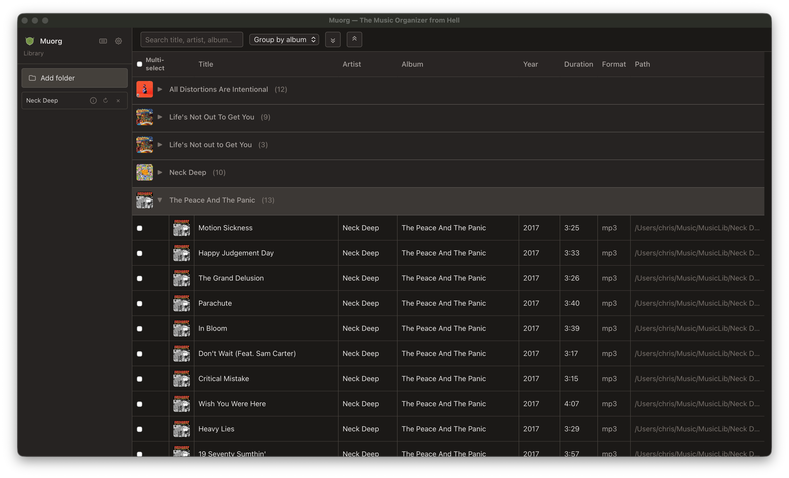
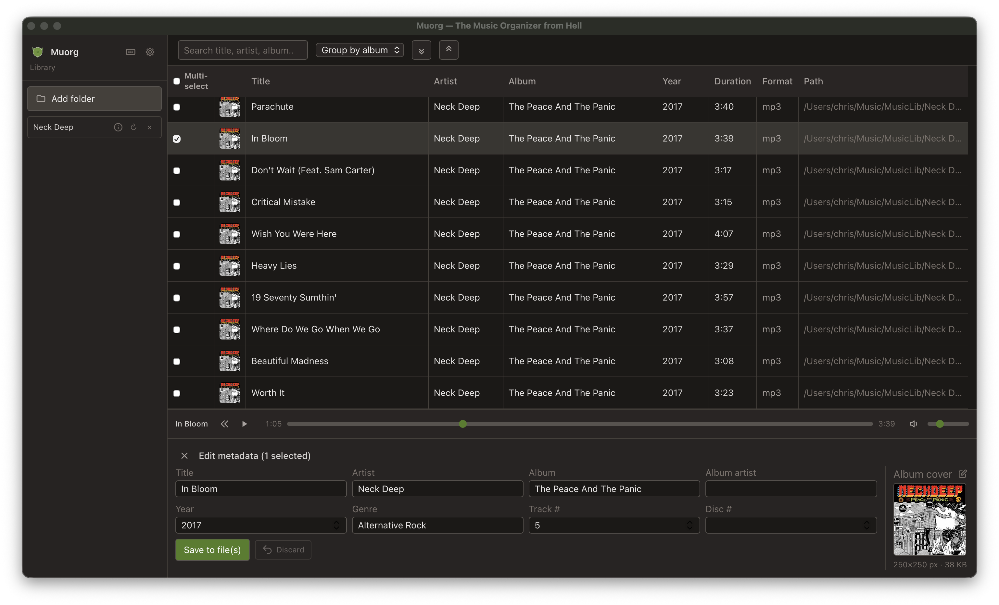
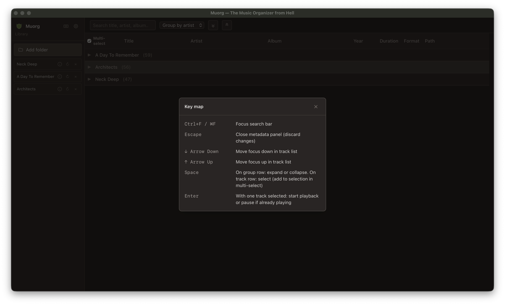

# Muorg — The Music Organizer from Hell

<div align="center">
  
  <br /><br />
  <em>Pronounced “Mu-Ork” — think of a Musical Ork who organizes your music.</em>
</div>

A cross-platform desktop app that organizes your music library with a dense, library-style UI. Add folders of MP3 and FLAC files, browse and search your catalog, and edit embedded metadata—title, artist, album, year, album art, and more—so your collection stays consistent and findable.


**Platforms:** macOS, Windows, Linux

---

## Features

- **Library** — Add folders (or drag-and-drop); Muorg scans for `.mp3` and `.flac` and builds a persistent catalog in SQLite. Rescan or remove folders from the sidebar.
- **Library view** — Table with album art, title, artist, album, year, duration, format, and path. Full-text search across title, artist, and album. Group by album or artist (collapsible; album art in group header when all tracks share the same art).
- **Metadata editor** — Edit tags (title, artist, album, album artist, year, genre, track/disc number) and embed or clear album art. Save to files; catalog updates automatically. **Bulk edit:** select multiple tracks and change only the fields you edit—other fields stay per-track.
- **Playback** — When one track is selected, a player bar offers play/pause, seek, volume, and mute. Press Enter to start or pause.
- **Theming** — Auto (follow system), Dark, Light, Orkish (green tints), and DOOM. Settings and key map (keyboard shortcuts) live in the sidebar.

See [plan.md](./plan.md) for the roadmap and priorities.

---

## Screenshots

Main library view:



Metadata editor (single track selected):



Key map and shortcuts:



---

## Tech stack

| Layer      | Choice              |
|-----------|----------------------|
| Desktop   | **Tauri 2** (Rust + web frontend) |
| Frontend  | **Vue 3** + **TypeScript** |
| Styling   | **Tailwind CSS**     |
| State     | **Pinia**            |
| Catalog   | **SQLite**           |
| Metadata  | Rust: `id3` (MP3), FLAC crates (FLAC) |

---

## Prerequisites

- [Node.js](https://nodejs.org/) (LTS) and [pnpm](https://pnpm.io/)
- [Rust](https://www.rust-lang.org/) (latest stable)
- [Tauri prerequisites](https://v2.tauri.app/start/prerequisites/) for your OS (e.g. system deps for Linux, WebView2 on Windows)

---

## Getting started

```bash
# Install dependencies (from project root)
pnpm install

# Run in development
pnpm tauri dev

# Build for production (installer for current OS)
pnpm tauri build
```

---

## Project structure

```
muorg/
├── src-tauri/          # Tauri (Rust) backend
│   ├── src/
│   │   ├── metadata/   # MP3/FLAC read & write
│   │   ├── catalog/    # Scan, index, SQLite
│   │   └── commands.rs # Tauri commands (scan, get_tracks, write_metadata, …)
│   └── ...
├── src/                # Vue frontend
│   ├── components/     # LibraryTable, MetadataEditor, AlbumCover, …
│   ├── composables/    # useCatalog, useSelection, …
│   ├── stores/         # Pinia stores
│   └── App.vue
├── plan.md             # Vision, features, technical direction
├── agent.md            # Contributor & AI agent guide
└── README.md
```

---

## Creating a release (GitHub)

Releases are built and published via GitHub Actions.

### Alpha builds (automatic)

- **Push to `main`** or run the workflow manually (**Actions → Build and Release → Run workflow**).
- The workflow builds the app for macOS (Apple Silicon + Intel), Windows, and Linux.
- Version is set to `0.1.0-alpha.<run_number>` (e.g. `0.1.0-alpha.42`). The run number increments with each workflow run.
- A **prerelease** is created with that version; installers (DMG, MSI/EXE, AppImage/Deb) are attached.

### Stable releases (tagged)

1. Bump the version in `package.json`, `src-tauri/tauri.conf.json`, and `src-tauri/Cargo.toml` (e.g. to `0.2.0`).
2. Commit and push.
3. Create and push a **tag** matching `v*` (e.g. `v0.2.0`):
   ```bash
   git tag v0.2.0
   git push origin v0.2.0
   ```
4. The **Build and Release** workflow runs on the new tag, builds all platforms, and creates a **full release** (not prerelease) with that version and the installers attached.

### Pipeline summary

| Trigger              | Version format           | Release type |
|----------------------|--------------------------|--------------|
| Push to `main`       | `0.1.0-alpha.<run_number>` | Prerelease   |
| Manual run           | same as above            | Prerelease   |
| Push tag `v*` (e.g. `v0.2.0`) | From tag (e.g. `0.2.0`) | Full release |

### macOS: “App is damaged” when opening

Releases are not signed or notarized with an Apple Developer certificate. After downloading the `.app` (from a DMG or the release assets), macOS may say **“Muorg.app is damaged and can’t be opened”**. This is Gatekeeper quarantining the app.

**Fix:** Remove the quarantine attribute, then open the app as usual:

```bash
xattr -cr /path/to/Muorg.app
```

Example if you moved the app to Applications:

```bash
xattr -cr /Applications/Muorg.app
```

After that, open Muorg from Finder or Spotlight as normal. To avoid the warning in the future, you can right‑click the app → **Open** the first time; macOS may then allow it without the “damaged” message.

### Pre-merge checks (Build and Lint)

The **Build and Lint** workflow (`.github/workflows/build.yml`) runs on every push to `main` and on every pull request targeting `main`. It runs in parallel:

- **Frontend:** `pnpm install --frozen-lockfile`, then `pnpm build` (TypeScript check + Vite build).
- **Rust:** `cargo check` and `cargo clippy` (with `-D warnings`).

Use it to validate changes before merging to `main`. You can run the same checks locally:

```bash
pnpm run check          # frontend + Rust (TypeScript build, cargo check, clippy)
pnpm run check:frontend # TypeScript check + Vite build only
pnpm run check:rust     # cargo check + clippy (requires Rust) only
```

---

## Documentation

- **[plan.md](./plan.md)** — Vision, goals, feature list (P1/P2/P3), UI concept, risks, success criteria.
- **[agent.md](./agent.md)** — Tech stack, repo layout, conventions, run/build, and guidance for contributors and AI agents.

---

## License

See repository for license information.
